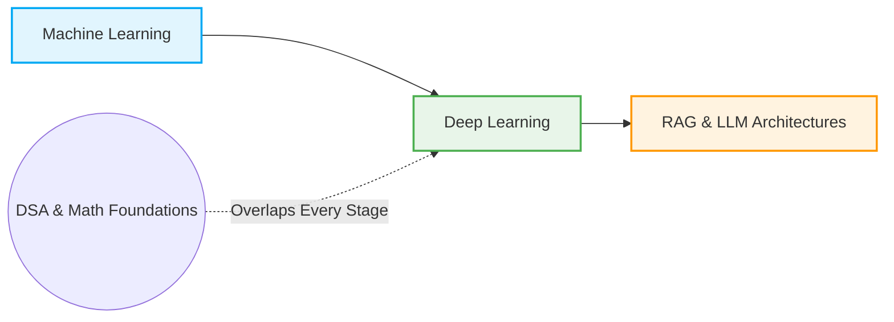

# Hi there, I'm Adar Dey! 🧮🧠🤖

  
  

### 🎓 Academic Profile
- 🏛️ **University:** Comilla University (CoU)
- 🧪 **Department:** Information and Communication Technology (ICT)
- 🧬 **The Mindset:** A dedicated enthusiast blending the analytic formulas of **Mathematics** and **Physics** with engineering and code.

---

### 🌌 My Learning Journey & Goals
- 🚀 **Current Focus:** Deeply invested in mastering **Machine Learning (ML)** fundamentals while simultaneously sharpening my **Data Structures & Algorithms (DSA)** skills in C++.
- 🔮 **The Future Horizon:** Moving next into **Deep Learning (DL)**, with the ultimate destination of exploring **RAG (Retrieval-Augmented Generation)** systems and **Large Language Models (LLMs)**.
- 📚 **Knowledge Sharing:** Author of Python guides on data science libraries and creator of conceptual, handwritten technical notes.

---

### 📚 Featured Open Source Guides & Notes
* 📖 **Python & Data Science Essentials Book:** A structured manual breaking down basic syntax and essential data science libraries.
* ✍️ **Handwritten DSA Manual:** Visual, step-by-step breakdowns of **Arrays**, **Binary Search**, and **Graph Theory** *(actively expanding)*.

---

### 🛠️ Core Toolkit & Academic Focus

<table>
  <tr>
    <td align="center" width="130">
       
      <b>Core Programming</b>
    </td>
    <td align="center" width="130">
       
      <b>DSA Practice</b>
    </td>
    <td align="center" width="130">
       
      <b>Matrix Math</b>
    </td>
    <td align="center" width="130">
       
      <b>Data Analytics</b>
    </td>
  </tr>
  <tr>
    <td align="center" width="130">
       
      <b>Machine Learning</b>
    </td>
    <td align="center" width="130">
       
      <b>ML Workspace</b>
    </td>
    <td align="center" width="130">
       
      <b>Technical Documentation</b>
    </td>
    <td align="center" width="130">
       
      <b>Version Control</b>
    </td>
  </tr>
</table>

---

### 🎯 Roadmap Blueprint

---

### 📊 Live GitHub Performance

  
  

  

